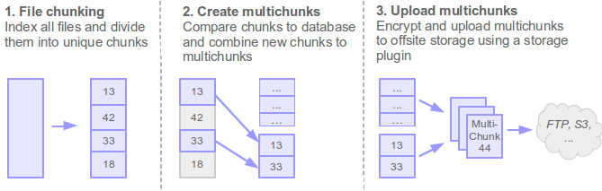
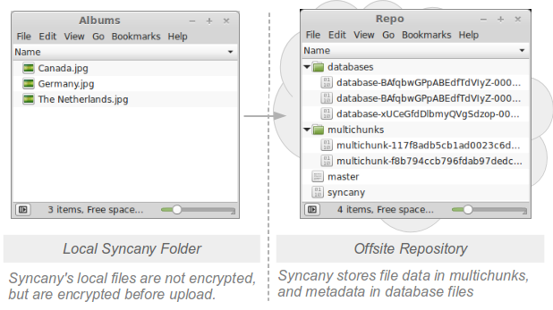

Concepts
========

**WORK IN PROGRESS: This is a work in progress. We are currently just copying relevant content in the corresponding chapters, and sorting stuff out. Feel free to contribute!**

There are a few very smart concepts built into Syncany that make it so flexible and differentiate it from other solutions. It's not necessary for users to understand these concepts, but it helps to understand why Syncany does things the way it does them.

This chapter explains the basic concepts of Syncany to the interested user in a hopefully understandable way. If you just want to use Syncany and don't care how it ticks inside, **you can safely skip this chapter**. 

.. contents::

Abstraction for dumb storage through a minimal API
--------------------------------------------------
Syncany offers quite a bit of options when it comes to where you can store your files. As the :doc:`plugins` page describes, the backend storage options are very flexible. The reason why that is possible is the **storage abstraction** concept of Syncany. 

For a storage backend to be usable with Syncany, a plugin for that backend only has to implement a very small set of operations. This **minimal storage interface** comprises just five methods to manage files on the offsite storage, which makes it incredibly easy to implement for developers:

* ``upload(local file, remote file)`` - Upload a local file to the offsite storage
* ``download(remote file, local file)`` - Download a file from the offsite storage
* ``move(remote file 1, remote file 2)`` - Move file on the offsite storage
* ``list(file type)`` - List remote files on the offsite storage
* ``delete(remote file)`` - Delete file from the offsite storage

Implementing these methods (plus a few helper functions) is enough to create a plugin. Plugins don't have to deal with connection handling, synchronization aspects, security issues or notifications. In particular, plugins don't have to deal with large files or resumable uploads/downloads. Syncany uploads files with a max. size of about 4 MB and manages connections itself. Plugins don't need to be bothered with any of that - Syncany takes care of that and thereby **keeps the reponsibility of a plugin very small**. 

Notably, **plugins don't have to implement any active components on the server side**. That means that there is no server component on the storage backend that has to deal with managing clients or connections. Instead, **any dumb storage backend** can be used to implement a plugin.

This obviously includes the classical storage systems such as (S)FTP or WebDAV, but it extends to using protocols that were't really built for storage backends: One could use IMAP to store files in e-mails, or use the Google Images/Picasa API to store files in images. With Syncany's minimal storage API, *any* storage can be used!

Minimizing remote disk space through deduplication
--------------------------------------------------
Normal sync tools like rsync or Unison simply copy files from the local machine to the offsite storage. Granted, they transfer files pretty efficiently, but they store files at the offsite storage as they store them locally. Two marginally different or even identical files locally take up the same disk space as locally. 

Syncany is different: Syncany uses **data deduplication** to minimize the amount of disk space used on the offsite storage. Deduplication exploits the similarities among different files to save disk space. It identifies duplicate sequences of bytes (chunks) and only stores one copy of that sequence. If a chunk appears again in the same file (or in another file of the same file set), deduplication only stores a reference to this chunk instead of its actual contents. Depending on the amount and type of input data, this technique can **significantly reduce the total amount of required storage**. [1]_

While this concept is typically used in backend systems of backup solutions, **Syncany performs deduplication on the client**: During the index process (in ``sy up``), Syncany breaks files into chunks and compares these chunks to the database. If chunks are new, they are marked for upload. If they are already known because they appeared in other files before, they are simply referenced. 

New chunks are packaged together into so-called **multichunks** (basically ZIP files containing chunks) and uploaded to the offsite storage. These multichunks exist for two reasons: Firstly, by combining chunks to multichunks, the **per-file upload latency and roundtrip time is reduced** significantly (if you've uploaded an Eclipse workspace via FTP, you know what I mean). And secondly, **multichunks are compressed and encrypted before upload** and thereby add another storage reduction mechanism and ensure data confidentiality and integrity (for encryption details see :doc:`security`).

Multichunks only store the raw chunk data. Metadata such as as file names and permissions is stored in database files. These **database files are XML-based delta databases**, each of which represents a *commit* describing what files were added, removed or renamed. They contain information about which chunks are stored in which multichunks and how to reassemble files. 

On the offsite storage, Syncany stores multichunks and database files side by side in a **repository**. Besides the multichunks and database files, this repository consists of the ``master`` file (containing the salt for the master key) and the ``repo`` file (containing repository-specific details). Since the repository is encrypted, it can only be read by another Syncany client in possession of the repository password. 

Privacy by design through client-side encryption
------------------------------------------------
Unlike other sync solutions, Syncany's encryption features are built-in by design and enabled by default. In fact, not encrypting the repository doesn't bring any user advantages and only minor performance benefits. Please refer to the :doc:`security` chapter for details.

Synchronization through vector clocks
-------------------------------------
The synchronization algorithm is one of Syncany's core elements. Its responsibility is to detect file changes among participating workstations and to bring them to the same state. This particularly includes what is known by most file synchronizers as *update detection* and *reconciliation* [2]_ [3]_ [4]_ [5]_ [6]_.

Update detection is the process of discovering where updates have been made to the separate replicas since the last point of synchronization [2]_. In state-based synchronizers [7]_ such as Unison or rsync, this is done by comparing the file lists of all replicas. The result is a global file list created by merging the individual lists into one. In trace-based synchronizers, update detection is based on the trace log of the replicas. Instead of a global file list, they generate a global file history based on the individual client histories. It typically compares histories and detects new file versions. Update detection must additionally detect conflicting updates and determine the winner of a conflict.

Once the global file list/history has been created, it must be applied to the local workstation. This is done in the reconciliation phase, which usually downloads new files, deletes old files and moves renamed files.

Due to its versioning requirements, **Syncany detects updates via trace logs** (file histories) of the individual clients. Histories of the participating clients are analyzed and compared to each other based on file identifiers, file versions, checksums and local timestamps. Syncany follows the **optimistic replication** approach. Clients populate their updates to the repository under the assumption that conflicts do not happen regularly. 

If a conflict occurs, each individual client detects it based on the trace log and determines a winner. The winning version of a file is restored from the repository and the local conflicting version is populated to the repository under a different name. [1]_

To detect these conflicts, Syncany uses `vector clocks <http://en.wikipedia.org/wiki/Vector_clock>`_ to mark delta databases uploaded by a client. 

XXXXXXXXXXXXx

Differences and similarities to other tools
-------------------------------------------
As stated in other posts, the fundamental idea of the Syncany software architecture is a mixture between a version control system like `Git <http://git-scm.com/>`_, `SVN <http://subversion.apache.org/>`_ or `Bazaar <http://bazaar.canonical.com/en/>`_, a file synchronization software like `rsync <http://rsync.samba.org/>`_ or `Unison <http://www.cis.upenn.edu/~bcpierce/unison/>`_, and crypto software such as `GPG <http://www.gnupg.org/>`_. 

Like in a **version control system** (VCS), Syncany keeps track of the files in a certain folder using metadata about these files (size, last modified date, checksum, etc.). It manages different versions of a file, detects if a file has been moved or changed and adds a new file version if it has. Like version control systems, Syncany knows a concept similar to a "commit", i.e. a collection of changes the local files that are uploaded to the central repository. In other ways, however, it is also very different: In contrast to Git and its friends, Syncany does not support the full range of commands that regular VCS do. For instance, there is no explicit branching or merging, no tagging and diffing. Instead, Syncany has only one trunk/master and auto-resolves conflicts when they occur (much like `Dropbox <http://www.dropbox.com/>`_ does). Unlike most VCS, Syncany does not focus on text-based files, but treats all files the same (large/small, binary/text). In addition, Syncany is not limited to one or two transport protocols, but can be easily extended to many more. 

The similarities to **file sync software** are quite obvious: Syncany must tackle the `file synchronization problem <http://blog.philippheckel.com/2013/05/20/minimizing-remote-storage-usage-and-synchronization-time-using-deduplication-and-multichunking-syncany-as-an-example/2/#Synchronization-Software>`_, i.e. the problem of keeping multiple replicas of a file set in sync. Much like the widely popular rsync, Syncany compares the local files to the remote copy (or at least its metadata) using date/time/size and checksums of both whole files and parts of files, and then transfers only the changed parts to the remote location. Like rsync, Syncany tries to minimize the individual upload/download requests (and the corresponding network latency) by grouping these changes into bigger blocks. However, while rsync does that by actively gathering the file stats on the remote system, Syncany only uses the downloaded metadata, i.e. using dumb storage is possible. 

Unlike any of the above mentioned tools, Syncany is **built with and around cryptography** and takes confidentiality and data integrity very seriously: Syncany generally assumes that everything but your local machine can be monitored/eavesdropped by others which is why it encrypts all data locally before uploading. As of now, Syncany only supports password-based symmetric key encryption based on configurable ciphers. By default, it uses 128 bit AES and Twofish, both in the authenticated GCM mode, but basically can support anything that Java and the Bouncy Castle crypto provider have to offer.

Further Resources
-----------------

* `Master Thesis: Minimizing remote storage usage and synchronization time using deduplication and multichunking: Syncany as an example <http://blog.philippheckel.com/2013/05/20/minimizing-remote-storage-usage-and-synchronization-time-using-deduplication-and-multichunking-syncany-as-an-example/>`_
* `Syncany explained: idea, progress, development and future (part 1) <http://blog.philippheckel.com/2013/10/18/syncany-explained-idea-progress-development-future/>`_
* `Deep into the code of Syncany - command line client, application flow and data model (part 2) <http://blog.philippheckel.com/2014/02/14/deep-into-the-code-of-syncany-cli-application-flow-and-data-model/>`_

.. rubric:: Footnotes

.. [1] Explanation of data deduplication taken from the thesis `Minimizing remote storage usage and synchronization time using deduplication and multichunking: Syncany as an example <http://blog.philippheckel.com/2013/05/20/minimizing-remote-storage-usage-and-synchronization-time-using-deduplication-and-multichunking-syncany-as-an-example/>`_.
.. [2] Balasubramaniam and B.C. Pierce. What is a file synchronizer? In Proceedings of the 4th annual ACM/IEEE international conference on Mobile computing and networking, pages 98-108. ACM, 1998.
.. [3] Kalpana Sagar and Deepak Gupta. Remote file synchronization single-round algorithms.International Journal of Computer Applications, 4(1):32-36, July 2010. Published By Foundation of Computer Science.
.. [4] Bryan O'Sullivan. `Distributed revision control with Mercurial <http://hgbook.red-bean.com/index.html>`_, 2009.
.. [5] Yasushi Saito and Marc Shapiro. Optimistic replication. ACM Comput. Surv., 37:42-81, March 2005.
.. [6] Anne-Marie Kermarrec, Antony Rowstron, Marc Shapiro, and Peter Druschel. The icecube approach to the reconciliation of divergent replicas. In Proceedings of the twentieth annual ACM symposium on Principles of distributed computing, PODC '01, pages 210-218, New York, NY, USA, 2001. ACM.
.. [7] Benjamin C. Pierce and Jérôme Vouillon. What's in unison? a formal specification and reference implementation of a file synchronizer. Technical report, 2004.
