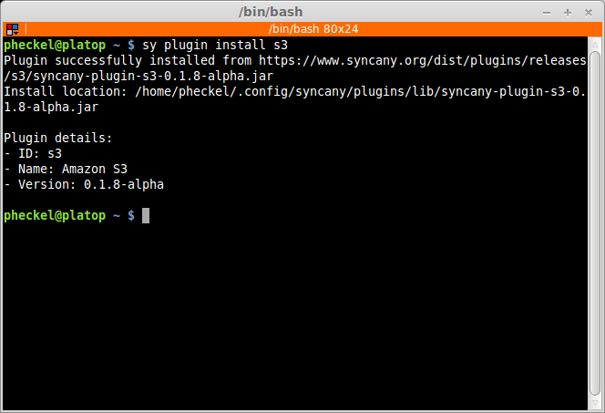
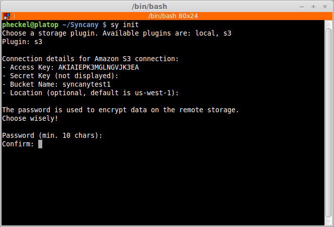
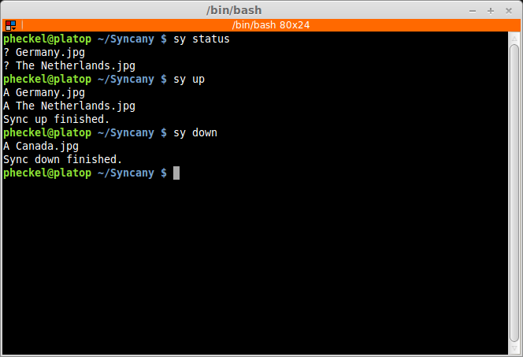
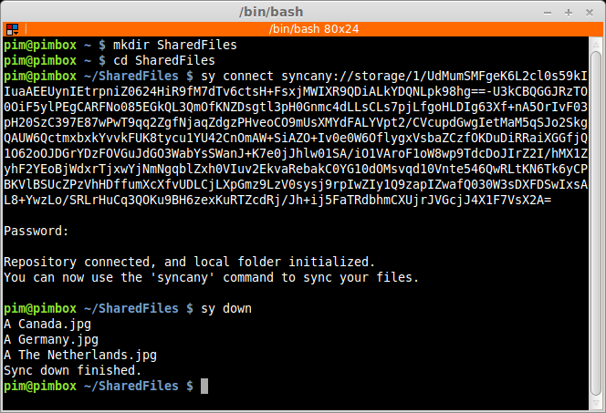

Getting Started
===============
Once you've :doc:`installed Syncany <installation>`, you can go ahead and open a terminal window and try out the ``sy`` command -- everything you can do with Syncany so far is implemented in this command. The typical order of commands is:

1. Install a :doc:`storage plugin <plugins>` using ``sy plugin install <plugin-id>``
2. Initialize a new repository with ``sy init``
3. Then sync files manually with ``sy up`` and ``sy down``, or automatically with :ref:`the daemon <overview_daemon>`
4. Connect and share with other clients with ``sy connect`` 

As of today, Syncany is only available as a command line tool. We're working on a graphical user interface, but until that is ready, you'll have to make due with the CLI.

.. contents::

Installing a storage plugin
---------------------------
First choose the storage backend you'd like to use by doing ``sy plugin list`` and then ``sy plugin install``. As of today, we've implemented a number of plugins. To get a complete list, check out the :doc:`plugins page <plugins>`. For this example, we'll install the Amazon S3 plugin:

Initializing a new repository
-----------------------------
Once the plugin is installed (in this example the Amazon S3 plugin), you can set up a new repository: To do that, simply navigate to the folder you want to synchronize and type ``sy init`` command. 

An **interactive command line interface** will ask you a couple of questions about how to connect to the offsite storage (hostname, credentials, etc.), and it will ask you for a password to encrypt your data with. 

        
As soon as you've successfully run the init command, the repository is all set up. You can now sync files to it using ``sy up`` and ``sy down``, and you can connect other client with the ``sy connect`` command. The command will output a link that you can share with trusted friends or colleagues that enables them to connect to the same repository.

Syncing files
-------------
Syncany repositories can be synchronized manually via the command line, or automatically with the help of the background process (or daemon):

* **Syncing files manually** is useful for automated backup jobs, or if you want to use Syncany like a version control system. 
* Using the **automatic syncing** turns Syncany into a Dropbox-like tool, because changes on local files are detected automatically and remote changes are synced right after they happen.

.. _getting_started_manually:

Manually syncing files
^^^^^^^^^^^^^^^^^^^^^^
To use Syncany for manual syncing, the ``sy status``, ``sy up`` and ``sy down`` commands are your best friends. These commands work similar to a version control system: 

* The ``sy status`` command shows you if you've made local changes
* The ``sy up`` command indexes and uploads these changes
* And the ``sy down`` command downloads and applies remote changes locally

   
Unlike a version control system, however, there is no need to first add, then commit and then push changes -- the ``sy up`` command combines these actions into one. Similarly, the ``sy down`` command fetches and applies changes in a single command. 

There are a couple of other very useful commands to manage a repository and a local Syncany folder: Use ``sy ls`` to show the current and past file tree, ``sy restore`` to restore old or deleted files, and ``sy cleanup`` to save space on the offsite storage by removing old file versions. A full list of commands can be found in :doc:`commands`.
	
.. _getting_started_automatically:
.. _overview_daemon:
	
Automatically syncing files 
^^^^^^^^^^^^^^^^^^^^^^^^^^^
*As of today, the automatic synchronizaton setup is not as easy as it should be. We are aware of that and are working on a solution.*

To set up a Dropbox-like folder synchronizaton for a Syncany folder, the folder has to be managed by the Syncany background process (also called *the daemon*). This background process can be started with ``syd start`` (note that the command is not ``sy``, but ``syd``). Once the daemon is started, all registered folders are monitored for changes and remote changes are automatically applied to the local folder. All of these actions happen in the background -- without the need for any intervention.

To register a folder (and do other things), the daemon can be configured using the daemon config file at ``%AppData%\Syncany\daemon.xml`` or ``~/.config/syncany/daemon.xml``. Assuming that you'd like ``/home/pim/Syncany`` to be monitored and automatically synchronized, simply add the folder to the ``daemon.xml`` config file like this:

.. code-block:: xml

	<daemon xmlns="http://syncany.org/daemon/1">
	   ...
	   <folders>
	      <folder>
		 <path>/home/pim/Syncany</path>
		 <enabled>true</enabled>		
	      </folder>
	   </folders>
	</daemon>
	
To let the daemon know about the new folder, run ``syd restart`` (or ``syd reload`` on Linux).

Connecting other clients 
------------------------
A Syncany repository can be shared among many clients. There are two methods for new clients to connect to an existing repository:

* Use ``sy connect`` to manually enter the backend storage credentials (just like with ``sy init``)
* Use ``sy connect <syncany-link>`` to avoid having to type the credentials by using a ``syncany://`` link

Both methods work equally well, but the ``syncany://``-link method is more convenient. A ``syncany://`` link contains the exact same information that was initially queried by the interactive ``sy init`` command -- namely the plugin-specific settings such as hostname, user/password, and so on. Clients that already have access to the repository can create such a link by calling ``sy genlink`` form within the Syncany folder. 

Once a new client is connected to a repository, all of the above mentioned commands can be used to either manually or automatically sync the repository.

While the ``syncany://``-link itself is encrypted and may be shared via unsecure channels, sharing the link *and* the repository password gives users read/write access to your repository and typically enables them to access the entire backend storage. 

.. warning::

	**Remember:** Do not share the ``syncany://`` link *and* the password with users that you do not fully trust. Users in possession of the link and the password might be able to delete/change files on the backend storage!
	
If, for instance, the repository is based on an FTP folder, the ``syncany://`` link contains the FTP username and password. Users with access to the Syncany repository can also access the FTP storage with a regular FTP client and delete/change files as they wish.
	

