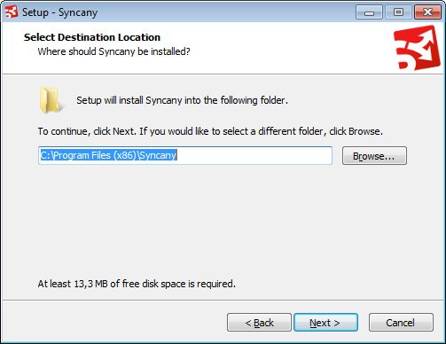
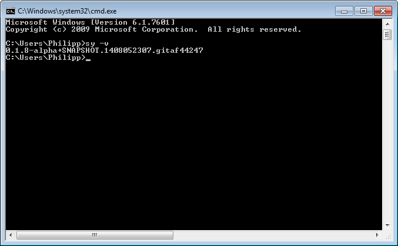

Installation
============
Syncany is written in pure Java, so it available on a number of platforms. To make the installation process as easy as possible, we've pre-bundled distributables for most major operating systems (a Mac OSX bundle is still missing, see `open issues <https://github.com/syncany/syncany/issues/34>`_). Whenever we release a new version of Syncany, we regenerate these bundles and publish them on the `distribution site <https://www.syncany.org/dist>`_.

On that site, you can find **releases** and **snapshots**. Releases are built and published in a certain release cycle (currently: 2 weeks), and snapshots are built with every commit. Feel free to try out both, but be aware that snapshots are very volatile and things might break without warning.

As of today, we provide the following download possibilities:

* Windows installer (.exe)
* Debian package (.deb)
* Ubuntu/Launchpad personal package archive (PPA)
* Arch Linux AUR 
* Docker Application
* Manual Installation (via .tar.gz/.zip)

.. contents::

Installation requirements
-------------------------
Since Syncany heavily relies on Java, you obviously need an up-to-date version of Java installed. And that is about it. No other requirements. 

* **Java/JRE >= 7**. Follow the directions on the `Oracle Website <java.com/download>`_ to install Java.
* **bash-completion >= 2** (Linux only). If it's not installed by default, it's definitely in the default packages.

Installing the latest release
-----------------------------

Windows
^^^^^^^
On Windows, you can either manually extract the Syncany files from the ZIP archive, or use the installer. The latter is obviously more comfortable, but both variants have their reasons. 

The installation using the Windows installer is easy and very similar to the installation of other applications. 

1. Download the latest release from the `distribution site <https://www.syncany.org/dist>`_ (see folder *releases*). The installer files have the *.exe* ending. You can't miss it.
2. Then run the executable and follow the instructions. 
3. After the installation, open the command prompt and type ``sy``.

When you run the executable, you'll see a typical installer that looks something like that:

   
Other than where to install Syncany, the installer will only give you two additional options. **If you are not sure what they mean, don't change them.**

* **Add Syncany to PATH environment variable (recommended)**: If you're unsure, leave this as is. For Syncany to be available on the command line, the command line will have to know where to look for it. If this option is unchecked, the ``sy`` command will not be available unless the installation path is added to the PATH environment variable.

* **Set JAVA_HOME environment variable (recommended)**: If you're unsure, leave this as is. Syncany relies on the Java Runtime Environment (JRE) and this variable tells the Syncany commands where to look for it. 

After the installation is complete, open the command prompt by typing ``cmd`` in the Windows search box, or by navigating to *Extras*, *Command Prompt* in the menu. If everything goes well, you'll see this after typing ``sy -v``:

Debian/Ubuntu
^^^^^^^^^^^^^
On Debian-based systems, the prebuilt *.deb*-packages can be installed via the regular package mananger. For Ubuntu, we additionally provide a personal package archive (PPA) for releases and snapshots. Unlike standalone Debian packages, PPAs provide the possibility to stay on the up-to-date version of Syncany, since new versions are updated with the regular system updates.

As stated above, the only requirements to install Syncany are Java and bash-completion. If they are not installed, simply get them from the default archives: ``sudo apt-get install default-jre bash-completion``. After that, the packages should work properly.

Installing via a **.deb-package**:

1. Download the latest release Debian package from the `distribution site <https://www.syncany.org/dist>`_ (see folder *releases*).
2. Double-click the *.deb*-package and click "Install", or type ``sudo dpkg -i syncany_<version>.deb`` from the command line.
3. After the installation, open the terminal and type ``sy``.

If you're more of a command line guy, simply do this:

.. code-block:: bash

	wget https://syncany.org/latest.deb
	sudo dpkg -i syncany-latest.deb
	sy -v

Installing via **Ubuntu/Launchpad PPA** (via command line):

1. Open your terminal, and add the Syncany release PPA by typing ``sudo add-apt-repository ppa:syncany/release``
2. You'll be asked to confirm the imported public key. Make sure the public key identifier is **52DA5B42**. If it's not, do not import the key!
3. Once that is done, you can now update the package archives by ``sudo apt-get update``, and install Syncany with ``sudo apt-get install syncany``.
4. After the installation, open the terminal and type ``sy``.

Again, for the command line lovers:

.. code-block:: bash

	sudo add-apt-repository ppa:syncany/release
	   # Verify that public key identifier is 52DA5B42!
	sudo apt-get update
	sudo apt-get install syncany
	sy -v

Arch Linux
^^^^^^^^^^
Arch Linux users can use the ``syncany`` package available on the `AUR <https://aur.archlinux.org/packages/syncany/>`_ to install Syncany. An AUR helper like yaourt could help with this:

::

    yaourt -S syncany

Docker
^^^^^^
If you just want to try Syncany for a few minutes, we provide it as a containerized `Docker <https://www.docker.com/>`_ application for Syncany. If you've installed Docker already, you can use the `syncany/release <https://registry.hub.docker.com/u/syncany/release/>`_ repository. 

::

	docker pull syncany/release
	docker run -ti syncany/release
	syncany@e52be0b2522b:~$ sy -v
	0.1.8-alpha

Manual Installation (for other operating systems)
^^^^^^^^^^^^^^^^^^^^^^^^^^^^^^^^^^^^^^^^^^^^^^^^^
If your operating system isn't listed above, or if you just want to install Syncany manually for some other reason, simply download either the .zip or the .tar.gz archive from the `distribution site <https://www.syncany.org/dist>`_ (see folder *releases*). Then extract the archive and run Syncany and/or the daemon from the ``bin/`` folder. This is the exact same process on every major operating system:

1. Download the latest archive from the `distribution site <https://www.syncany.org/dist>`_ (see folder *releases*)
2. Extract the archive and run ``bin/sy`` to run the Syncany command line tool

If you'd like to use Syncany from there, but without having to always type the entire path to run it, you may want to place the Syncany ``bin/`` folder in the system's ``PATH`` environment variable. This will let your system know where to look for the ``sy`` command. It's easy to find out how to do that, but just in case:

- `How to set the PATH variable on Windows <http://www.computerhope.com/issues/ch000549.htm>`_
- `How to set the PATH variable on Mac OSX <http://architectryan.com/2012/10/02/add-to-the-path-on-mac-os-x-mountain-lion/>`_
- `How to set the PATH variable on Linux <http://www.troubleshooters.com/linux/prepostpath.htm>`_

Installing the latest snapshot
------------------------------
In addition to the releases, we also provide **snapshot versions** of Syncany. Snapshots are bundles that reflect the cutting edge state of development. They are created for every single commit in our versioning system, so updates come very frequently -- sometimes up to dozens of times per day. Unless you'd like to test a new feature before everyone else or you are asked by a developer to install that version, it is highly discouraged. **Things might break. They might be incompatible to previous versions. Or it might not work at all.**

If you're sure you want to install a snapshot, the process is very similar to the steps above. The only thing that differs is the file or access channel where you get the installer/package.

* For Windows, download the latest snapshot installer `from the snapshots folder <https://www.syncany.org/dist/snapshots/>`_.
* For Debian, download the latest snapshot package `from the snapshots folder <https://www.syncany.org/dist/snapshots/>`_.
* For Ubuntu, use the `snapshots PPA on Launchpad <https://launchpad.net/~syncany/+archive/ubuntu/snapshot>`_ (``ppa:syncany/snapshot``).
* For Arch Linux, use the `Git package on AUR <https://aur.archlinux.org/packages/syncany-git/>`_.
* For Docker, use the `Docker snapshot repository <https://registry.hub.docker.com/u/syncany/snapshot/>`_ (``syncany/snapshot``).
* And for other operating systems, download the latest snapshot .tar.gz/.zip `from the snapshots folder <https://www.syncany.org/dist/snapshots/>`_.

Installing from source
----------------------
Syncany hosts its `code on GitHub <https://github.com/syncany/syncany>`_, so if you want to compile Syncany from source, you definitely can -- and we encourage you to do so. Since this is a user manual, however, we don't want to go into too much detail about the build process. There are details about building available `on the Wiki page <https://github.com/syncany/syncany/wiki/Building>`_.

In short, run this:

::

	git clone http://github.com/syncany/syncany
	cd syncany        
	./gradlew installApp         (on Linux / Mac OS)
	gradlew installApp           (on Windows)
	
This compiles and installs the Syncany command line client to ``syncany-cli/build/install/syncany/bin/syncany``. You can run it from there.

