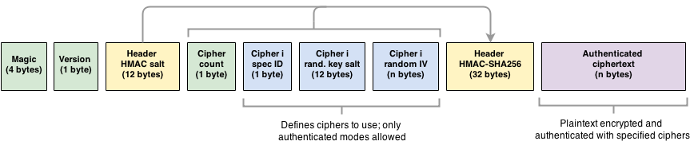
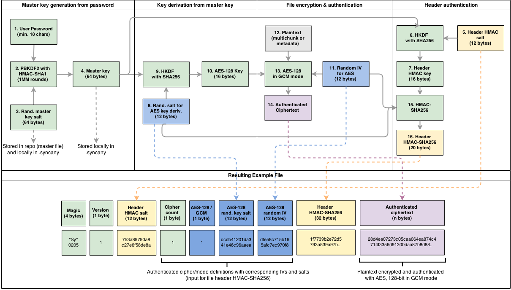

Security Concept
================
Syncany takes security very seriously. Our goal is to protect the confidentiality of user data stored on remote servers -- meaning that whatever leaves the local computer is encrypted. 

*WORK IN PROGRESS*

Security Assumptions
--------------------
- Syncany assumes that the local machine is secure, data is unencrypted there; so are access credentials and passwords/keys. Measures to mitigate credential/key exposure are underway (#168), but are not high priority.
- Syncany can protect data confidentiality (including metadata) and data integrity (file content and metadata are AES/GCM'd before upload, this includes filenames and directory structure). 
- Syncany provides no measures to ensure data availability: (a) both provider and other trusted users (with storage credentials) may detectably alter or even delete encrypted files on the remote storage. (b) Also, an attacker with storage access may alter the master salt (stored in the clear, obviously) to prevent new clients from connecting to the repository.
- Syncany cannot prevent the leakage of information about the frequency of downloads/uploads and the amount of data transferred by clients (e.g. through FTP logs). 
- Syncany can furthermore not prevent or detect if the master key or password has been stolen or was used by an adversary. 
- As of today, neither the master key nor the password can be changed (#150).

Crypto File Format
------------------

metadata protection

Crypto Algorithms and Parameters
--------------------------------
- Users of a shared folder (= repository) share a password
- The local machine is assumed to be secure (no encryption on the local machine)
- Input parameters: Password string, list of cipher specs (e.g. AES/GCM/NoPadding, 128 bit)
- The user password is used to derive one symmetric key per cipher using PBKDF2 (12 byte salt, 1 million rounds)
- The derived symmetric key(s) are used to encrypt files; each key is reused in max. 100 files (~ 200 MB)
- Cipher algorithms are configurable, but not every cipher is allowed:
  only AES and Twofish (128/256 bit), only authenticated modes (as of now only GCM; no ECB, CBC, etc.)
- Ciphers are initialized with a random initialization vector (IV), IVs are never re-used
- Multiple cipher algorithms can be nested/chained (1-n ciphers), e.g. AES-128 and Twofish-256
- Cipher configurations, IVs and salts are authenticated with an HMAC-SHA256

- Master key: PBKDF2 with 1MM round, random 512 bit salt
- HKDF: Derive key from master key ...
- AES/GCM + Twofish/GCM for multichunk/chunk
- RSA 2048-bit keypair for self-signed certificates (web frontend and REST/WS interface)

IVs are definitely never reused. Syncany only compares chunk checksums with one another, and it only does that on the clients. No calculation is or can be done on the server, since the server is just a dumb storage (FTP, etc.). A new file is broken into chunks and these chunks are then compared to the local database (chunk exists -> store reference, chunk does not exist -> store chunk data in new multichunk). 

Example
-------

