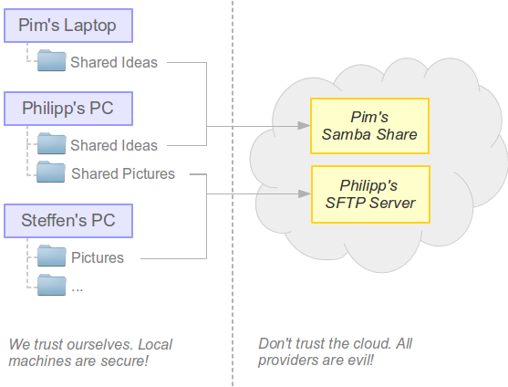

What is Syncany?
================
**WORK IN PROGRESS: This is a work in progress. We are currently just copying relevant content in the corresponding chapters, and sorting stuff out. Feel free to contribute!**

Syncany is an open source Dropbox-like file sync and backup tool. It synchronizes files and folders between computers either manually or automatically. Users can define certain folders on their machine and keep them in sync with friends or colleagues. 

So what makes Syncany **awesome**?

* Automatic/continuous file synchronization
* Use-your-own storage (FTP, S3, WebDAV, NFS, Samba/Windows file share, ...)
* Files are encrypted before upload (don't trust anybody but yourself)
* Files are `deduplicated <http://en.wikipedia.org/wiki/Data_deduplication>`_ locally (massive space savings on remote storage)
* Files are intelligently versioned (restoring old versions or deleted files is easy)

**Excited yet? Ready to learn more?**

.. image:: _static/what_is_syncany_overview.png
   :align: center

Syncany takes the idea of a Dropbox-like continuous file synchronization tool and applies it to the real world: It makes use of the storage that is *available* rather than being bound to a certain protocol or backend a certain provider is offering. **With a simple plugin-based storage system, Syncany can turn almost anything into a usable backend storage**. Right now, it can use folders on an FTP or SFTP storage, WebDAV or Samba shares and Amazon S3 buckets, but that's just the beginning. Because it's so easy to implement plugins, more are definitely coming. Even things like using IMAP folders or Flickr's free 1 TB of image data could be used to store your data.

Besides its incredible flexibilty in terms of storage, Syncany is also a very privacy-aware software: **User data never leaves the local machine without being encrypted**. Data confidentiality and user privacy are the taken very seriously -- 128-bit AES+Twofish/GCM encryption is built-in by default.

Combining these two features makes Syncany really awesome: You can use all of the free storage that the Internet gives you (Google Drive, OneDrive, etc.) to share your files, but you don't have to worry about your privacy. Syncany takes care of encryption before files are uploaded.

How do I use it?
----------------
As of today, Syncany is available as **a command line tool** on all major operating systems. We're working on a **graphical user interface** and a **web frontend**, but until that is ready, you'll have to make due with the command line. 

You can either `manually trigger <getting_started_manually>`_ the file synchronization like you do with Git, rsync or Unison; or you can let the Syncany background process `automatically sync your files <getting_started_automatically>`_. Check out the :doc:`Getting Started Guide <getting_started>` to learn more.

Who needs another sync tool?
----------------------------
There are many sync tools like Syncany out there, so depending on your use case, Syncany might just not be for you. The target audience for Syncany is not the average *cloud user* (you know, the one who puts his life in a provider's hand), but rather the more privacy-aware user and/or users/companies that want to use their own storage:

* If you want to share files with friends or colleagues without having to trust anyone but yourself, Syncany is the right tool for you.
* If you want to use your own offsite storage instead of a provider-controlled storage, Syncany is the right tool for you.

What Syncany is **not**!
------------------------
Because there are so many sync tools out there, it's very easy to assume that Syncany is just like the others. Here are a few things that Syncany is not:

* Syncany is not a free or pay-as-you-go service. Syncany is a tool.
* Syncany does not provide storage. **You must bring your own storage.**
* Syncany is not a peer-to-peer network. Data is stored centrally and you must trust the persons you share files with.
* Syncany has version control capabilities, but it is not a fully fledged version control system like Git.
* Syncany is **not yet usable for critical files**. It's alpha software. Don't do it!

Example Use Cases
-----------------
We've identified four major use cases that Syncany can be used for:

* No-server continuous file synchronization
* With-server continuous file synchronization
* Interval-based or on-demand backups 
* Simple binary-compatible file versioning

Use Case 1: No-server continuous file synchronization aka Friends sharing files 
^^^^^^^^^^^^^^^^^^^^^^^^^^^^^^^^^^^^^^^^^^^^^^^^^^^^^^^^^^^^^^^^^^^^^^^^^^^^^^^
Pim wants to share some ideas with Philipp, and Philipp wants to share some pictures with Steffen. Pim has a Windows server running a Samba server (Windows share), and Philipp has has a virtual server from a random hosting company lying around -- all set up with a spare SFTP account. 

   
Pim sets up a Syncany shared folder with Philipp, using the shared Windows folder on his server as a backend storage. He uses the ``sy init`` command to do that, types in ``samba`` to use the Windows share plugin, and chooses a strong password to encrypt the data with. After the one-minute setup, he gets a syncany://-link from Syncany. This link contains all the information required to access the storage. Philipp can now use this and the password to access the Syncany folder (using the ``sy connect`` command). Since the everything that lands in the *cloud* is encrypted with a key derived from the password, Pim and Philipp don't have to worry about a nosy storage provider or other interested parties.

The process between Philipp and Steffen is exactly the same, only that now Philipp initializes the repository on his own remote storage, and that the SFTP plugin is used. 

Use Case 2: Sharing in a company
^^^^^^^^^^^^^^^^^^^^^^^^^^^^^^^^

With server + web interface
